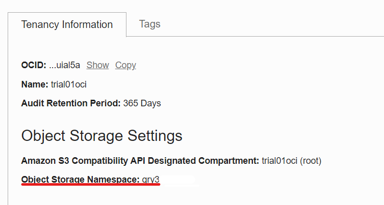
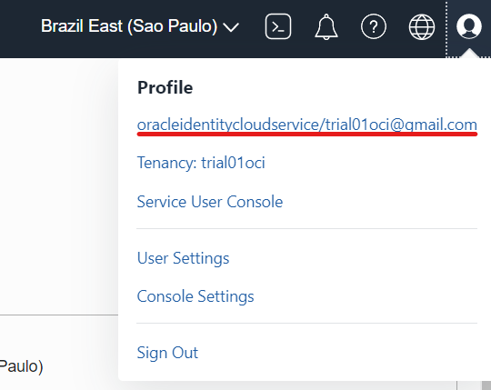
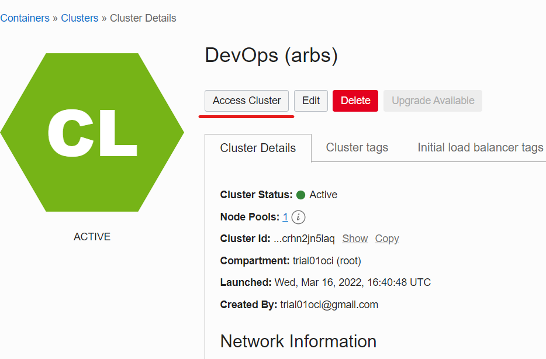
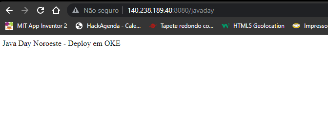

# Lab - Developing Cloud Native Applications

Laboratório para mostrar na prática como fazer o deploy de uma aplicação na Oracle Cloud.

## Objetivo

Criar uma aplicação no Kubernetes com as imagens de container armazenadas no Oracle Container Registry (OCIR). O aplicação será exposta através do External IP do Load Balancer.

- [Lab - Developing Cloud Native Applications](#lab---developing-cloud-native-applications)
  - [Objetivo](#objetivo)
  - [Coleta de Informações](#coleta-de-informações)
    - [Tenancy Namespace](#tenancy-namespace)
    - [User OCID \& Auth Token](#user-ocid--auth-token)
    - [Código da Região](#código-da-região)
  - [Docker Login](#docker-login)
  - [Criar Cluster](#criar-cluster)
  - [Configurar o Kubectl](#configurar-o-kubectl)
  - [Copiar o Código](#copiar-o-código)
  - [Configurar e fazer o Deploy do app](#configurar-e-fazer-o-deploy-do-app)
    - [Docker Build](#docker-build)
    - [Docker Push](#docker-push)
    - [Criando Secret no Kubernetes](#criando-secret-no-kubernetes)
    - [Configurar o Manifesto de Kubernetes](#configurar-o-manifesto-de-kubernetes)
    - [Deploy no Kubernetes](#deploy-no-kubernetes)
  - [Testando o acesso da aplicação via "External IP"](#testando-o-acesso-da-aplicação-via-external-ip)

## Coleta de Informações

Vamos coletar algumas informações na tenancy do OCI que serão utilizadas ao logo do laboratório, recomendamos que as anote em um bloco de nota para ter sempre em mãos de modo fácil. Serão coletadas as seguintes informações:

```bash
Tenancy Namespace:
User Name:
Auth Token:
Código da Região:
```

### Tenancy Namespace

Clique no menu do lado direto no icone do usuário, clique no nome da sua tenency.


Agora copie o namespace para o bloco de notas.



### User OCID & Auth Token

Clique no menu do lado direto no icone do usuário, clique no nome do seu usuário.



Copie o OCID do usuário e salve no bloco de notas.

Depois, vá em Auth Tokens e gere um novo token, salve o token no bloco de notas.


### Código da Região

Você pode pesquiar o código da sua região [aqui](https://docs.oracle.com/en-us/iaas/Content/Registry/Concepts/registryprerequisites.htm#regional-availability)

## Docker Login

Vamos precisar do Docker para fazer o build dos containers da aplicação e fazer o push para o OCIR. Antes do push, precisamos nos logar no OCIR através do docker-CLI.

Abra o **Cloud Shell** e execute o comando abaixo substituindo o username, tenanacy ocid e código da região. E na senha utilize o Auth Token gerado anteriormente.

```bash
docker login <codigo Region>.ocir.io
```
Insira seu namespace/username como **USERNAME**.

Resultado:

```bash
password: <Auth Token>
WARNING! Your password will be stored unencrypted in /home/trial01oci/.docker/config.json.
Configure a credential helper to remove this warning. See
https://docs.docker.com/engine/reference/commandline/login/#credentials-store
```

## Criar Cluster

Na console da OCI vá em **Developer Services > Containers & Artifacts > Kubernetes Clusters (OKE)**.

Selecione o compartment em que deseja criar o cluster.

Clique em "Criar" e escolha a opção "Quick Create" para criar já criar os recursos necessários e aguarde até o final do provisionamento.

## Configurar o Kubectl

Agora vamos configurar o acesso ao Kubernetes via Kubectl no Cloud Shell.

Entre no cluster criado clique no botão **Access Cluster**



Copie o comando que aparece no popup e execute no cloud shell.

Exemplo:

```bash
$ oci ce cluster create-kubeconfig --cluster-id ocid1.cluster.oc1.sa-saopaulo-1.aaaaaaaan2pf --file $HOME/.kube/config --region sa-saopaulo-1 --token-version 2.0.0  --kube-endpoint PUBLIC_ENDPOINT

New config written to the Kubeconfig file /home/trial01oci/.kube/config

```

O acesso pode ser testado com o seguinte comando:

```bash
kubectl get nodes
```

Deve ter uma resposta parecida com essa:

```bash
NAME           STATUS   ROLES   AGE     VERSION
10.20.10.125   Ready    node    3h23m   v1.21.5
10.20.10.138   Ready    node    3h23m   v1.21.5
10.20.10.208   Ready    node    3h23m   v1.21.5
```

## Copiar o Código

Abra o Cloud Shell e execute o git clone do código da aplicação (ou de alguma aplicação sua customizada que já contenha DockerFile):

```bash
git clone https://github.com/pedrocarrijo95/LabJavaOKE.git
```

## Configurar e fazer o Deploy do app

Navegue até a pasta do projeto:

```bash
cd LabJavaOKE
cd appjava 
```

Vamos realizar o build da imagem do backend e depois fazer o push para o OCIR.

### Docker Build

Execute o comando:

```bash
docker build -t <Codigo Region>.ocir.io/<tenancy-namespace>/javaday/appjava .
```

### Docker Push

Depois da Build vamos fazer o push para o OCIR

```bash
docker push <Codigo Region>.ocir.io/<tenancy-namespace>/javaday/appjava
```

### Criando Secret no Kubernetes

Vamos criar um secret que irá conter as informações do login do OCIR. Permitindo assim que seja feito o pulling das images.

Basta executar esse código, substituindo os valores

```bash
kubectl create secret docker-registry registrysecret --docker-server=<region-key>.ocir.io --docker-username='<tenancy-namespace>/oracleidentitycloudservice/<oci-username(email)>' --docker-password='<oci-auth-token>' --docker-email='<email-address>'
````

Resposta:

```bash
secret/registrysecret created
```

### Configurar o Manifesto de Kubernetes

Editar o código yaml para adicionar os parametros da imagem:

```bash
vi app.yaml
```

Pressione **i** para editar.

Substitua os valores de **Image-Name** nas seguites linhas:

```note
Image-Name = <Codigo Region>.ocir.io/<tenancy-namespace>/javaday/appjava
```

```yaml
      - name: javaapp
        image: <regionID>.ocir.io/id3kyspkytmr/javaday/appjava:latest
        imagePullPolicy: Always
        ports:
        - containerPort: 8080
```

Após substituir os valores utilize os seguintes comando **ESC : WQ** e pressione Enter.

### Deploy no Kubernetes

Com o arquivo editado podemos executar o seguinte comando para realizar o deploy:

```bash
kubectl apply -f app.yaml
```

Deve ter uma saida como **CREATED**

Podemos usar o seguinte código para saber se os pods já estão no ar:

```bash
kubectl get pods
```


## Testando o acesso da aplicação via "External IP"

Primeiro precisamos descobrir o IP do **Load Balancer** que foi criado neste deploy que fizemos.

```bash
kubectl get services
```

Agora bastar copiar o **External IP** e colar como uma url em outra aba do navegador, adicionando no fim da URL a porta configurada **:8080/javaday**


